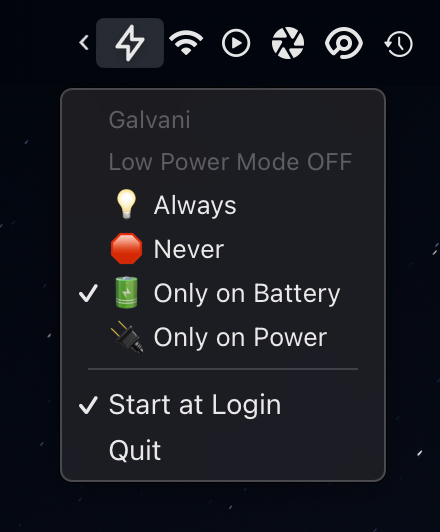

# Galvani

Galvani is a lightweight MenuBar application to manage Low Power Mode on MacOS.

# Introduction

*  when Low Power Mode if `ON` 
*  When Low Power Mode is `ON`
* Admin privileges are required when switching modes

